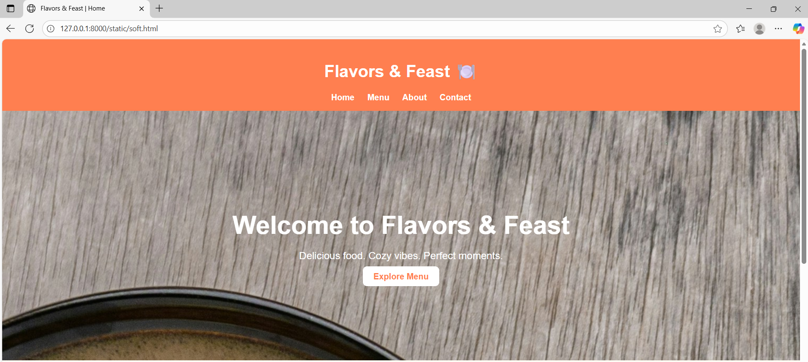

# Ex.07 Restuarant Website
## Date:

## AIM:
To develop a static Resturant website to display the menu and services provided by the resturant.

## DESIGN STEPS:

### Step 1:
Requirement collection.

### Step 2:
Creating the layout using HTML and CSS.

### Step 3:
Updating the sample content.

### Step 4:
Choose the appropriate style and color scheme.

### Step 5:
Validate the layout in various browsers.

### Step 6:
Validate the HTML code.

### Step 7:
Publish the website in the given URL.

## PROGRAM:

```
soft.html

<!DOCTYPE html>
<html lang="en">
<head>
  <meta charset="UTF-8">
  <meta name="viewport" content="width=device-width, initial-scale=1.0">
  <title>Flavors & Feast | Home</title>

  <style>
    body {
      margin: 0;
      font-family: 'Poppins', sans-serif;
      background-color: #ffffff;
      color: #333;
    }

    header {
      background: #ff7f50;
      color: white;
      text-align: center;
      padding: 1rem;
    }

    nav {
      margin-top: 10px;
    }

    nav a {
      color: white;
      margin: 0 10px;
      text-decoration: none;
      font-weight: bold;
    }

    nav a:hover {
      text-decoration: underline;
    }

    .hero {
      background: none;
      background-color: #ffffff;
      color: #333;
      text-align: center;
      padding: 150px 20px;
    }

    .hero h2 {
      font-size: 3em;
      margin-bottom: 10px;
    }

    .hero p {
      font-size: 1.2em;
    }

    .btn {
      background: #fff;
      color: #ff7f50;
      padding: 10px 20px;
      text-decoration: none;
      border-radius: 8px;
      font-weight: bold;
      transition: 0.3s;
    }

    .btn:hover {
      background: #ffe4c4;
      color: #333;
    }

    .intro {
      text-align: center;
      padding: 40px;
    }

    .intro img {
      width: 70%;
      max-width: 500px;
      border-radius: 10px;
      margin-top: 20px;
      box-shadow: 0 4px 8px rgba(0,0,0,0.1);
    }

    footer {
      background: #222;
      color: white;
      text-align: center;
      padding: 15px;
      margin-top: 20px;
    }
  </style>
</head>

<body>
  <!-- Header Section -->
  <header>
    <h1>Flavors & Feast 🍽️</h1>
    <nav>
      <a href="index.html">Home</a>
      <a href="menu.html">Menu</a>
      <a href="about.html">About</a>
      <a href="contact.html">Contact</a>
    </nav>
  </header>

  <!-- Hero Section -->
  <section class="hero">
    <h2>Welcome to Flavors & Feast</h2>
    <p>Delicious food. Cozy vibes. Perfect moments.</p>
    <a href="menu.html" class="btn">Explore Menu</a>
  </section>

  <!-- About Preview Section -->
  <section class="intro">
    <h2>Why Dine With Us?</h2>
    <p>At Flavors & Feast, we blend the freshest ingredients with a touch of love to give you meals that speak to your soul. Whether you're craving a cheesy pizza, creamy pasta, or a juicy burger, we’ve got you covered!</p>
    
  </section>

  <footer>
    <p>© 2025 Flavors & Feast</p>
  </footer>
</body>
</html>

menu.html

<!DOCTYPE html>
<html lang="en">
<head>
  <meta charset="UTF-8">
  <meta name="viewport" content="width=device-width, initial-scale=1.0">
  <title>Menu | Flavors & Feast</title>

  <style>
    body {
      margin: 0;
      font-family: 'Poppins', sans-serif;
      background-color: #fffaf3;
      color: #333;
    }

    header {
      background: #ff7f50;
      color: white;
      text-align: center;
      padding: 1rem;
    }

    nav {
      margin-top: 10px;
    }

    nav a {
      color: white;
      margin: 0 10px;
      text-decoration: none;
      font-weight: bold;
    }

    nav a:hover {
      text-decoration: underline;
    }

    h1 {
      margin: 0;
    }

    .menu {
      display: flex;
      flex-wrap: wrap;
      justify-content: center;
      gap: 25px;
      padding: 40px;
    }

    .dish {
      background: white;
      border-radius: 10px;
      box-shadow: 0 3px 8px rgba(0,0,0,0.1);
      width: 250px;
      text-align: center;
      transition: transform 0.3s ease;
    }

    .dish:hover {
      transform: scale(1.05);
    }

    .dish img {
      width: 100%;
      border-radius: 10px 10px 0 0;
    }

    .dish h3 {
      margin: 10px 0 5px 0;
      color: #ff7f50;
    }

    .dish p {
      margin: 0 10px 10px;
    }

    footer {
      background: #ece9e9;
      color: white;
      text-align: center;
      padding: 15px;
      margin-top: 20px;
    }
  </style>
</head>

<body>
  <!-- Header Section -->
  <header>
    <h1>Our Menu 🍽️</h1>
    <nav>
      <a href="index.html">Home</a>
      <a href="menu.html">Menu</a>
      <a href="about.html">About</a>
      <a href="contact.html">Contact</a>
    </nav>
  </header>

  <!-- Menu Section -->
  <section class="menu">
    <div class="dish">
      
      <h3>Italian Pasta</h3>
      <p>Rich, creamy, and full of flavor.</p>
    </div>

    <div class="dish">
      
      <h3>Cheese Burst Pizza</h3>
      <p>Melty cheese goodness in every bite.</p>
    </div>

    <div class="dish">
      
      <h3>Classic Burger</h3>
      <p>Juicy patty with fresh veggies.</p>
    </div>

    <div class="dish">
      
      <h3>Hakka Noodles</h3>
      <p>Perfectly tossed with veggies and sauces.</p>
    </div>

    <div class="dish">
      
      <h3>Fresh Juices</h3>
      <p>Refreshing fruit blends made fresh.</p>
    </div>
  </section>

  <!-- Footer -->
  <footer>
    <p>Bon Appétit 🍕 | © 2025 Flavors & Feast</p>
  </footer>
</body>
</html>

about.html

<!DOCTYPE html>
<html lang="en">
<head>
  <meta charset="UTF-8">
  <meta name="viewport" content="width=device-width, initial-scale=1.0">
  <title>About | Flavours & Feast</title>
  <style>
    * {
      margin: 0;
      padding: 0;
      box-sizing: border-box;
      font-family: 'Poppins', sans-serif;
    }

    body {
      background-color: #fffaf5;
      color: #2c2c2c;
      line-height: 1.6;
    }

    header {
      background-color: #c8c5c4;
      color: white;
      text-align: center;
      padding: 1.5rem 0;
      box-shadow: 0 4px 8px rgba(0,0,0,0.2);
    }

    nav {
      background: #2c2c2c;
      display: flex;
      justify-content: center;
      gap: 30px;
      padding: 1rem;
    }

    nav a {
      text-decoration: none;
      color: white;
      font-weight: bold;
      transition: 0.3s;
    }

    nav a:hover {
      color: #dcd9d7;
    }

    .about-container {
      max-width: 1000px;
      margin: 50px auto;
      text-align: center;
      padding: 20px;
    }

    .about-container h2 {
      font-size: 2.5rem;
      color: #e6e2e0;
      margin-bottom: 20px;
    }

    .about-container p {
      font-size: 1.1rem;
      margin-bottom: 30px;
      color: #444;
    }

    .team {
      display: flex;
      flex-wrap: wrap;
      justify-content: center;
      gap: 30px;
    }

    .member {
      background: white;
      border-radius: 15px;
      box-shadow: 0 4px 10px rgba(0,0,0,0.1);
      width: 280px;
      padding: 20px;
      transition: 0.3s;
    }

    .member:hover {
      transform: scale(1.05);
    }

    .member img {
      width: 100%;
      height: 220px;
      border-radius: 10px;
      object-fit: cover;
    }

    .member h3 {
      color: #ff914d;
      margin-top: 10px;
    }

    .member p {
      color: #555;
      margin-top: 5px;
    }

    footer {
      background-color: #2c2c2c;
      color: white;
      text-align: center;
      padding: 1rem 0;
      margin-top: 50px;
    }
  </style>
</head>
<body>
  <header>
    <h1>About Us</h1>
  </header>

  <nav>
    <a href="index.html">Home</a>
    <a href="menu.html">Menu</a>
    <a href="about.html">About</a>
    <a href="contact.html">Contact</a>
  </nav>

  <section class="about-container">
    <h2>Welcome to Flavours & Feast!</h2>
    <p>Founded in 2020, <b>Flavours & Feast</b> is a cozy place where every dish tells a story. 
      From sizzling grills to creamy pastas, our chefs bring passion and creativity to every plate.  
      We blend local flavors with global cuisines to give you an unforgettable dining experience — served with warmth and a smile. 😋
    </p>

    <h2>Meet Our Chefs 👨‍🍳</h2>
    <div class="team">
      <div class="member">
        
        <h3>Chef Arjun</h3>
        <p>Head Chef & Grill Expert</p>
      </div>

      <div class="member">
        
        <h3>Chef Kiara</h3>
        <p>Dessert Queen 🍰</p>
      </div>

      <div class="member">
        
        <h3>Chef Aadhav</h3>
        <p>Creative Cuisine Specialist</p>
      </div>
    </div>
  </section>

  <footer>
    <p>© 2025 Flavours & Feast | Crafted with ❤️</p>
  </footer>
</body>
</html>

contact.html

<!DOCTYPE html>
<html lang="en">
<head>
    <meta charset="UTF-8">
    <meta name="viewport" content="width=device-width, initial-scale=1.0">
    <title>Contact Us | Flavours & Feast</title>
    <style>
        body {
            margin: 0;
            font-family: 'Poppins', sans-serif;
            background-color: #fff8f0;
            color: #333;
        }

        header {
            background-color: #ff6347;
            color: white;
            padding: 20px;
            text-align: center;
        }

        nav a {
            text-decoration: none;
            color: white;
            margin: 0 15px;
            font-weight: 500;
        }

        nav a:hover, .active {
            text-decoration: underline;
        }

        .contact-section {
            padding: 50px;
            text-align: center;
        }

        .contact-container {
            display: flex;
            justify-content: space-around;
            flex-wrap: wrap;
            margin-top: 30px;
        }

        form {
            background-color: #fff;
            padding: 25px;
            border-radius: 12px;
            box-shadow: 0 2px 10px rgba(0,0,0,0.1);
            width: 300px;
            text-align: left;
        }

        form input, form textarea {
            width: 100%;
            padding: 10px;
            margin-top: 8px;
            margin-bottom: 15px;
            border-radius: 8px;
            border: 1px solid #ccc;
            font-size: 14px;
        }

        button {
            background-color: #ff6347;
            color: white;
            border: none;
            padding: 12px 20px;
            border-radius: 8px;
            cursor: pointer;
            width: 100%;
        }

        button:hover {
            background-color: #e5533c;
        }

        .contact-info {
            background-color: #fff;
            padding: 25px;
            border-radius: 12px;
            box-shadow: 0 2px 10px rgba(0,0,0,0.1);
            width: 300px;
            text-align: left;
        }

        footer {
            background-color: #ff6347;
            color: white;
            text-align: center;
            padding: 10px;
            margin-top: 50px;
        }

        iframe {
            margin-top: 25px;
            border-radius: 12px;
            width: 90%;
            max-width: 600px;
            height: 300px;
            border: none;
        }
    </style>
</head>
<body>
    <header>
        <h1>Flavours & Feast</h1>
        <nav>
            <a href="index.html">Home</a>
            <a href="menu.html">Menu</a>
            <a href="about.html">About</a>
            <a href="contact.html" class="active">Contact</a>
        </nav>
    </header>

    <section class="contact-section">
        <h2>Contact Us</h2>
        <p>We’d love to hear from you! Whether you have a question, feedback, or just wanna say hi, drop us a message below 🍴💬</p>

        <div class="contact-container">
            <form>
                <label>Name:</label>
                <input type="text" placeholder="Your Name" required>

                <label>Email:</label>
                <input type="email" placeholder="Your Email" required>

                <label>Message:</label>
                <textarea placeholder="Type your message here..." required></textarea>

                <button type="submit">Send Message</button>
            </form>

            <div class="contact-info">
                <h3>Reach Us At</h3>
                <p><strong>📍 Address:</strong> 24 Food Street, Erode, Tamil Nadu</p>
                <p><strong>📞 Phone:</strong> +91 98765 43210</p>
                <p><strong>✉️ Email:</strong> contact@flavoursandfeast.com</p>
                <p><strong>🕒 Open Hours:</strong> Mon - Sun | 10 AM - 11 PM</p>
            </div>
        </div>

        
    </section>

    <footer>
        <p>© 2025 Flavours & Feast. All rights reserved.</p>
    </footer>
</body>
</html>
```


## OUTPUT:

 
 
 


## RESULT:
The program for designing software company website using HTML and CSS is completed successfully.
